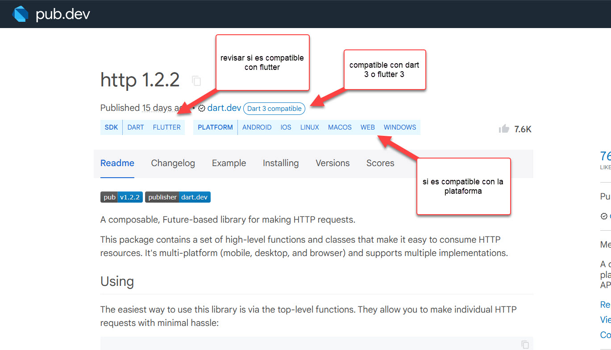
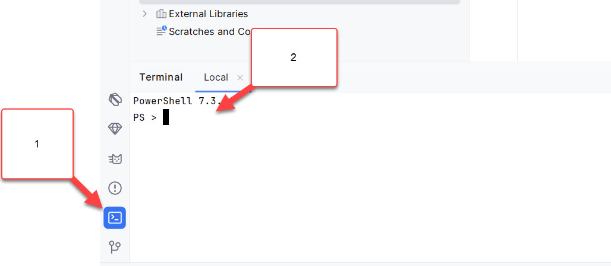

# flutter20240801_1

Quiero hacer un web service para listar usuarios

- [x] limpiar el proyecto inicial
- [x] agregar la libreria de web service.

En la siguiente página, estan los repositorios de las librerias a utilizar

[The official repository for Dart and Flutter packages. (pub.dev)](https://pub.dev/)



Como instalar la libreria:

1. En Android Studio, abra la consola
2. y pegue la linea de instalacion de la libreria



Para instalar la libreria HTTP, se debe ejecutar lo siguiente:

```
flutter pub add http
```


- [x] modelo
  - [x] Obtener el JSON del web service (si se puede leer)
    - [ ] [seg.cl/api/User/get/admin](https://seg.cl/api/User/get/admin)

```json
{
    "UserName": "admin",
    "Password": "admin",
    "Level": "admin"
}
```

- [x] Luego, vaya a la siguiente página.
  - [x] [JSON to Dart (javiercbk.github.io)](https://javiercbk.github.io/json_to_dart/)

- [x] service
  - [x] UsuarioSrv
    - [ ] obtenerListado
- [x] widget de pagina
  - [x] Ciclo:
    - [x] initState() Cuando parte la pagina, debe leer los datos
    - [ ] build() Y después, los debe mostrar
  - [x] Datos (estados):
    - [x] Un listado de usuario
- [x] widget de listview

## Un formulario para agregar elementos

- [x] En la clase de servicio voy a necesita una función que se conecte al web service y envie Productcategory

- [ ] Una pagina para el formulario

- [ ] Un widget de formulario

